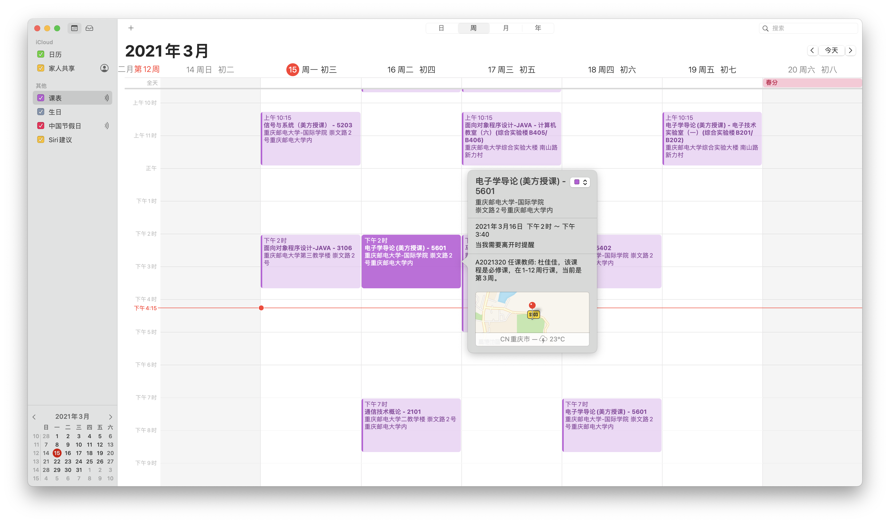
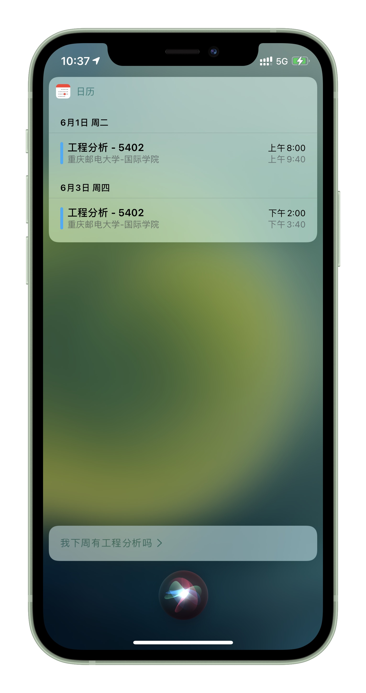
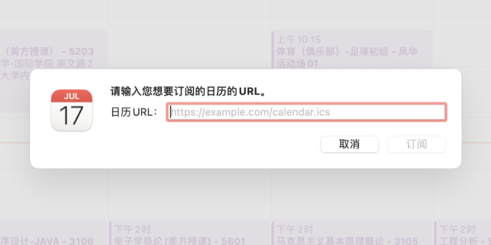

## CQUPT-ics

[](https://github.com/qwqVictor/CQUPT-ics/actions/workflows/build-images.yaml)

**重庆邮电大学学生课表 iCal (.ics) 自动生成工具。支持创建日历订阅，支持教学楼定位。**

如果你非重庆邮电大学学生，请访问 [python-ical-timetable](https://github.com/junyilou/python-ical-timetable) 项目，可手动生成学生课表。



## 功能

* 为你的课表、考试安排生成跨平台可用的通用日历文件 .ics
* 仅需提供学号即可生成，支持多种课表数据源
* 自动为每个日历项添加教学楼 GPS 定位功能

## 为什么使用 iCal

在诸如 Apple 日历、Google Calendar 的日历 app 中创建日历项，不仅可清晰的了解日程安排，更可体验 iOS、Android 系统为日历提供的各种功能：计划出行时间、日程提醒、如 Siri 与 Google Assistant 等智能语音助理自动化服务等。

例如，在 iOS 设备中添加日历项后，你可以直接向 Siri 询问：「我下周五有什么日程？」获得下周五的课表；或是在 Apple Watch 表盘上显示下一个课程的时间；或是使用 Shortcut 捷径进行更多操作。



打开教务在线，或是 We 重邮、掌上重邮查询课表则无法享受上述系统级服务和功能。

## 使用

#### 运行环境

* 本代码需要使用 **Python 3**，建议版本在 Python 3.7 以上。

* 在最近的更新中我们使用异步框架重构了程序，因此依赖 requests_html 和 asyncio，可通过 pip 安装。

  ```
  pip3 install -r requirements.txt
  ```

#### 运行

**直接输出课表到终端中，只需输入学号，如**

```
python3 cli.py 2020220202
```

**输出课表到 ics 文件，使用 -o 指定输出文件名，如**

```
python3 cli.py -o cqupt.ics 2020220202
```

可以通过传入 `-h` 或 `--help` 参数查看更多帮助。

对于生成的 .ics 文件，通常只需打开即可导入（Windows、macOS、Android），对于 iOS 和 iPadOS 用户，需使用 AirDrop 将文件传到设备，或者想办法通过 Safari 浏览器访问此文件。

## 进阶使用

### 日历起始日期

代码将尝试分析本学期第一周星期一的日期，以此为起始日生成所有课表。在部分情况下该数据可能发生错误，可指定 start-day 运行参数手动指定起始日期，如：

```
python3 cli.py -o cqupt.ics 2020220202 --start-day 2020-03-01
```

### 课表数据源

本程序现支持多种课表数据源，当前已经接入的有：

- `redrock` 重庆邮电大学红岩网校开发的「掌上重邮」app 数据源（默认）
- `wecqupt` 蓝山工作室开发的「We重邮」小程序数据源（2022 年起，We重邮 开始认证请求课表的微信用户的小程序 OpenID，若未提供可能无法获取数据，可使用 `WE_OPENID` 环境变量传入）
- `jwzxdirect` 从教务在线直接爬取（关于教务在线数据源的使用详见[文档](docs/jwzxdirect.md)）

您可以通过在指定 provider 参数修改使用的数据源，如：

```
python3 cli.py --provider wecqupt 2020220202
```

对于服务器端，您可以使用环境变量 `DEFAULT_PROVIDERS` 来指定加载的数据源和顺序，例如如果我们希望只依次序使用教务在线数据源和掌上重邮数据源，则可以这样执行：

```
DEFAULT_PROVIDERS=jwzxdirect,redrock python3 server.py
```

您还可以为本程序开发新的数据源，详见[文档](docs/providers.md)。

### 服务器使用和日历订阅

**什么是日历订阅？订阅日历和导入日历有什么区别？请参考[文档](docs/ImportOrSubscribe.md)。**

对于进阶用户，你可能有自己的服务器，希望运行此代码，自动获得最新的课表并创建 iCalendar 订阅，这样，你的设备也将定期向服务器刷新课表，自动获得课表更新。

本代码完全兼容服务端使用，经测试，**Apple 日历、Google Calendar、Outlook Calendar 均支持本代码生成的 ics**，同样也支持订阅本代码生成的 ics。



可运行 `server.py` 或通过 Uvicorn 运行此程序，亦可使用 Docker 镜像，随后便可直接在浏览器中请求日历文件，例如：

```
http://127.0.0.1:2021/2020xxxxxx.ics
```

一些 GET 参数：
 * `class`: 默认为 1，传入 0 可去除课程
 * `exam`: 默认为 1，传入 0 可去除考试信息
 * `geo`: 默认为 1，传入 0 可去除定位信息
 * `provider`: 指定数据源

请留意服务端版依赖 FastAPI 和 Uvicorn，可通过 pip 安装。

```
pip3 install -r requirements_server.txt
```

**要了解如何向 Apple 设备添加日历订阅，请参考[文档](docs/ImportOrSubscribe.md)。**

## 问题反馈与联系

本程序最初由 [@junyilou](https://github.com/junyilou) 开发，现版本主要由 [@qwqVictor](https://github.com/qwqVictor) 和 [@junyilou](https://github.com/junyilou) 共同维护。您可以直接提交 Issue，或通过 Telegram [@shunitsu](https://t.me/shunitsu) 或 [@qwqVictor](https://t.me/qwqVictor) 联系作者。

本程序[以 MIT 许可协议](LICENSE)开放源代码。
